# Wire protocol implementation guide

## Introduction

The communication between the game and the Wire service relies on the
[Centrifuge](https://github.com/centrifugal/centrifuge)
[protocol v2](https://github.com/centrifugal/protocol) using the Websocket
transport.
Implementations of this protocol already exist in different languages.
Those libraries are listed in the
[Centrifuge github page](https://github.com/centrifugal/centrifuge).
You can also find insightful knowledge in the [Centrifuge go package
documentation](https://pkg.go.dev/github.com/centrifugal/centrifuge) website.

The Wire service make use of a subset of the Centrifuge functionalities.
To make a SDK for Wire, it is not necessary to implement the full protocol.

This document will focus on this subset of the Centrifuge protocol as well
as what's expected by the Wire service to properly communicate with it.

## Centrifuge functionality matrix

This is the list of the functionalities exposed by the whole centrifuge protocol.
The checked ones are the ones needed directly or indirectly by Wire.

### connection/related features
- [x] connect to a server
- [x] setting client options
- [x] automatic reconnect with backoff algorithm
- [ ] client state changes
- [x] command-reply
- [x] command timeouts
- [ ] async pushes
- [x] ping-pong
- [ ] connection token refresh
- [ ] handle disconnect advice from server
- [ ] server-side subscriptions
- [x] batching API				
- [ ] bidirectional WebSocket emulation			

### client-side subscription related features
- [x] subscribe to a channel
- [ ] setting subscription options
- [ ] automatic resubscribe with backoff algorithm
- [x] subscription state changes
- [x] subscription command-reply
- [x] subscription async pushes
- [ ] subscription token refresh
- [ ] handle unsubscribe advice from server
- [ ] manage subscription registry
- [ ] optimistic subscriptions

## Centrifuge concepts

The Centrifuge protocol is a communication protocol on top of Websocket
that tackles real-time messaging. Among other things it has a topic based
pub-sub paradigm that powers Wire.
Here are a few concepts used by the Centrifuge protocols.

### Channel

A channel is a string representing a topic in the topic based pub-sub pattern.
This string must be provided by a client when subscribing, and any push messages
sent by the server will be attached to a channel.

### Command and Reply

[Command](#command-diagram) and [Reply](#reply-diagram) are two base messages that can be
sent respectively by the Client and the Server in the centrifuge protocol. A Command is
sent by the client to express a request to the server. A Reply will be sent by the server
to reply to a Command, or to send a push message.

The Command has a non-zero `id` field that is unique in the client session. The client is
fixing its value. Generally, we advise the client to start at 1 and increment for each new 
command.
When sending a Reply to a Command, the server will set the `id` field of the Reply to the id 
of the Command it replies to. That way it's easy to map a Reply to its Command in case more
than one Command are in flight.

Depending on the nature of the Command, **one and only one** of the following fields must be set
by the client:
* connect
* subscribe
* unsubscribe
* ping

The Reply to a *connect* command will have a *connect* field, same goes for subscribe and unsubscribe.

The server can also send Reply messages that are not in response to commands sent by the client.
In this case the id field won't be set or will be 0. This Reply messages are [Push](#push-diagram)
messages and will have their `push` field set.  
Wire will only send 2 types of push messages: [Publication](#publication-diagram) and
[Unsubscribe](#unsubscribe-diagram). 
* [Publication](#publication-diagram) messages are the one carrying the actual messages
updates on a subscription.
* [Unsubscribe](#unsubscribe-diagram) messages are notification that the server forcefully
terminated a subscription.

### Error
[Error](#Error-Diagram) can occur on the service side during the fulfilment of a Command.
The general outcome is a [Reply](#Reply-diagram) object with the `error` field set.

In the special case of Connection Commands, the websocket connection will be terminated.

### Message batching

In certain cases, the Centrifuge server will have to send several message in a very
short interval of time. It will decide to concatenate those centrifuge message and send
them in a single Websocket message.
The message are then concatenated using a new line character (`\n`) as a separator.

### Subscribing at connection time

To save time and bandwidth, the Client can join several subscribe request to their
connection request.
To do so, the client needs to provide a map that associate channels to their 
[subscription request](#subscriberequest-diagram) in the `subs` field of the
[connect request](#connectrequest-diagram). The Wire server will treat each
subscription individually, and provide a map containing the
[subscription results](#subscriberesult-diagram) in the `subs` field of the
[connect result](#connectresult-diagram).

## Centrifuge protocol transactions

### Connection

The connection procedure is composed of two parts:
* websocket connection
* centrifuge Command/Reply transaction

First of all we need to establish a connection with the Wire websocket server.
It's a secured websocket connection, the url is `wss://wire.unity3d.com/v2/ws`.

Once the websocket connection is established a centrifuge connection transaction
has to be initiated as soon as possible. It's  a Command/Reply transaction, the
Command sent by the client will contain a ConnectRequest object, the Reply from
the server will contain a ConnectResult object.

> NOTE  
> Exceptionally, in case of error during a connection transaction, for
example if the token verification fails, instead of sending a Reply with an Error
object, the server will terminate the connection with a WebsocketNormal close code.

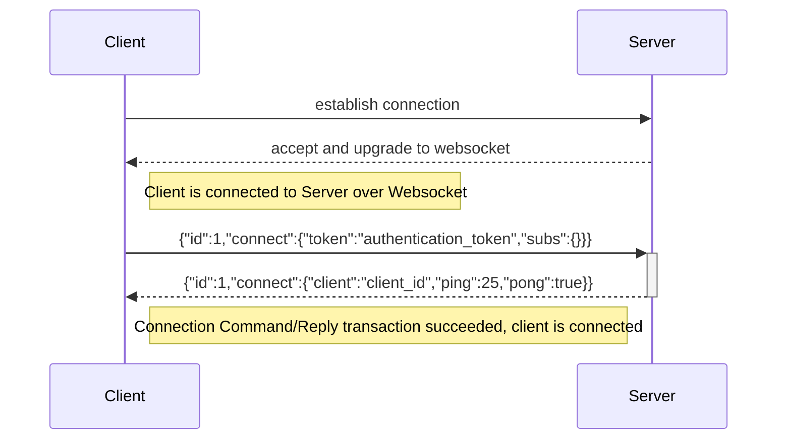

### Maintaining a Centrifuge connection

The Centrifuge server will keep testing the connection to detect when
a connection is failing.

The ConnectionResult object passed by the server at connection time
informs the client about the interval at which the server will send
pings.
In the example below, the servers notify the client that the ping
interval will be of 25s.
* the client can detect that the connection with the server is severed if:
  * the server didn't respect the ping interval advertised
  (it is recommended to allow around 10s slack)
* the server can detect that the connection with the client is severed if:
  * the server didn't receive the client pong after a certain amount of time.

In both case, the connection will be closed, the client can try and retry a
new connection.

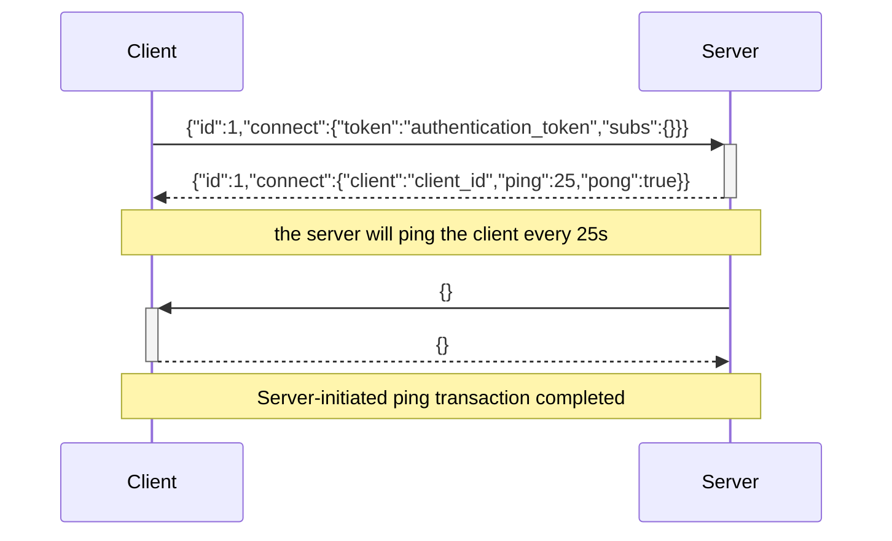
### Subscribing/Unsubscribing
Wire is a topic based pub/sub system. In order to subscribe to a topic (or channel), we use the
Subscribe Command/Reply transaction.

A Subscribe transaction is initiated by the client, it sends a Command containing a SubscribeRequest
object. The server replies with a Reply containing either an Error object, or a ConnectResult
object.

The Unsubscribe transaction is initiated by the Client when they no longer wants to receive
updates on a specific topic. The Command sent by the client will contain an UnsubscribeRequest
object, while the Reply will contain an UnsubscribeResult, or an Error.
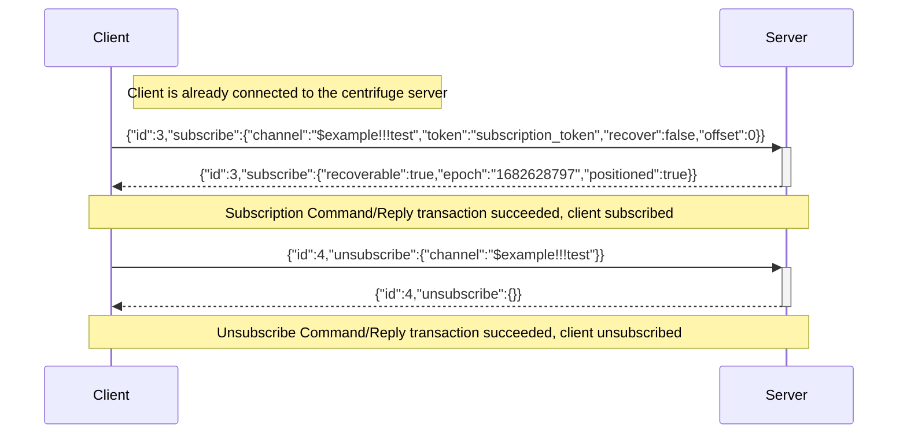

### Receiving Subscription publications

Whenever a new message is published on a topic, every subscribed clients will receive a Push message
containing a Publication object.
The Publication object contains the WireMessage envelope in the data field.
The Wire envelope contains the message published by the service.
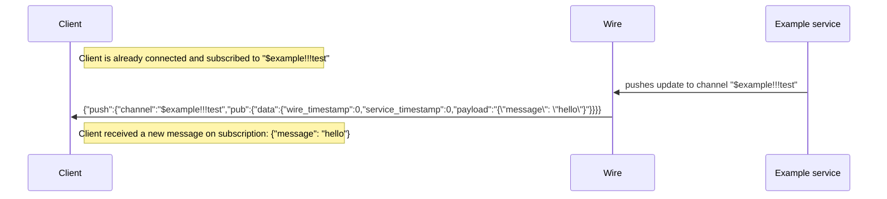

## Wire integration

Wire integrates centrifuge and will use only a subset of its functionalities. It will also
enforce or expect a few things.  

### Authentication

As for every Unity services, the Wire service expects an authentication token emitted by the
Unity Authentication Service. This token must be provided in the `token` field of the
[ConnectionRequest](#connectrequest-diagram) object passed to the Connection
[Command](#command-and-reply).

### Authorization

Wire allows Unity services to publish messages on topic that can be subscribed by clients.
While Centrifuge allows the notion of public channels, Wire only uses private channels.
That means that to subscribe to a channel, one must provide a token to have that
subscription granted by Wire.
In Wire, each channel is *owned* by a Unity service. In consequence, only the service owning
a channel can provide a token to subscribe to a channel.  
Also, a Wire connection is attached to a player identity (see [Authentication](#authentication)),
and any subscription token provided during a Wire centrifuge session, will be checked so that the
player identity matches.  
The subscription token is provided in the `token` field of the [SubscribeRequest](#subscriberequest-diagram)
object passed in the subscribe [Command](#command-and-reply).

### Wire envelope

Wire passes messages published by the service inside a [WireMessage](#wiremessage-diagram) envelope.
The message published by the service will be in the `payload` field as a string.

### Sequence

Here is a sequence diagram of a typical session using a third party
service (Lobby service) as an example.

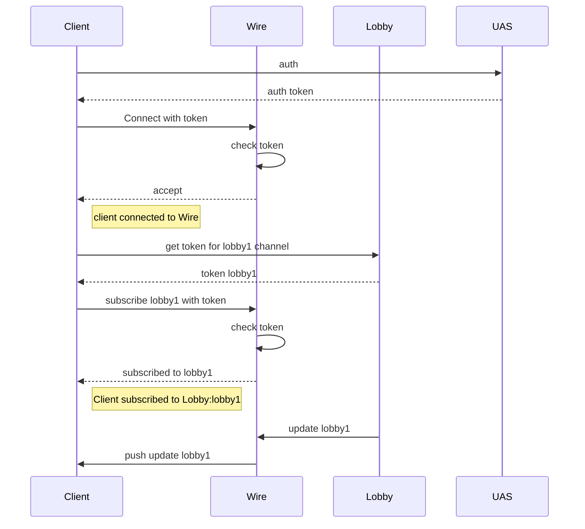

## Centrifuge and Wire classes

### Command Diagram
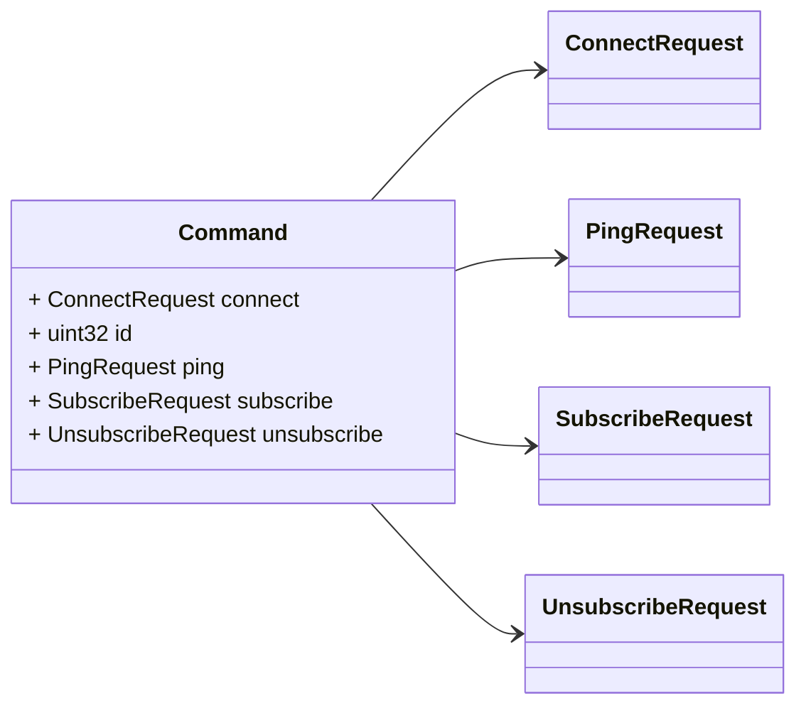
### Reply Diagram
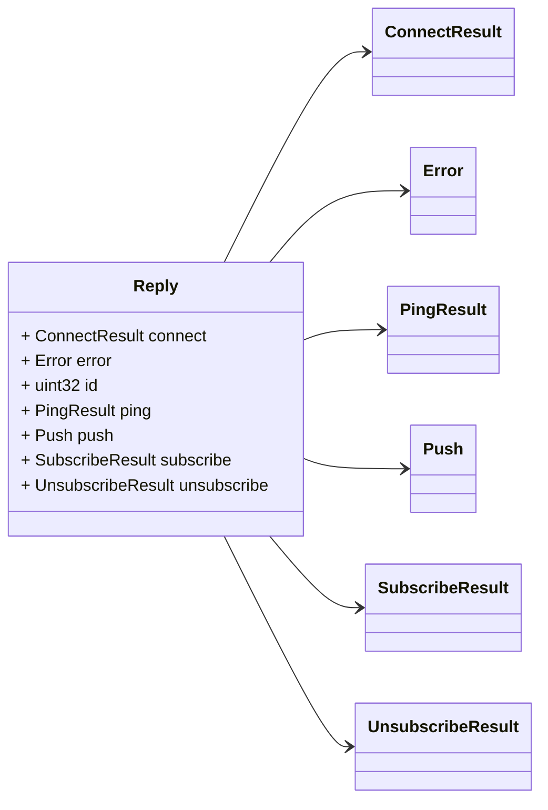
### Error Diagram
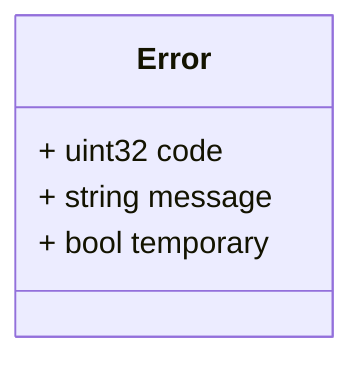
### Push Diagram
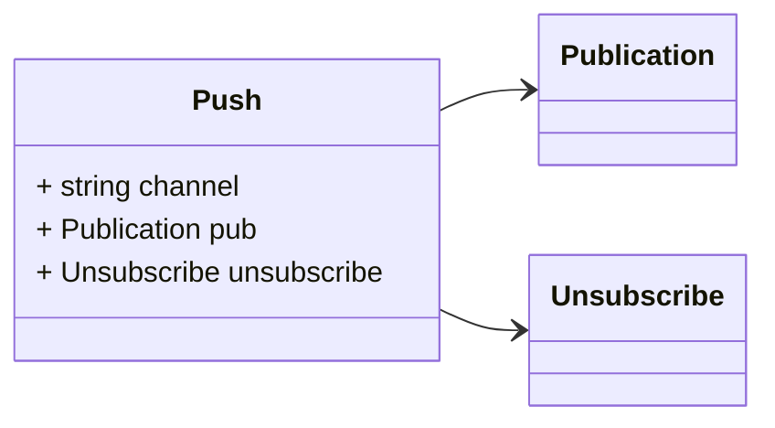
### ClientInfo Diagram
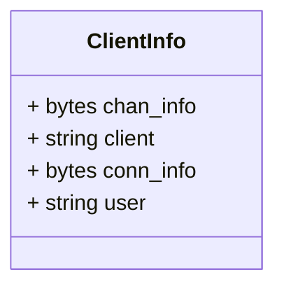
### Publication Diagram
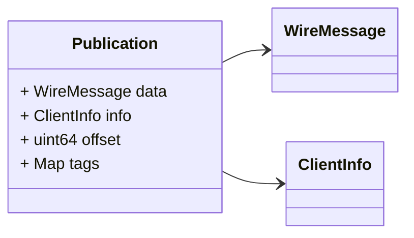
### WireMessage Diagram
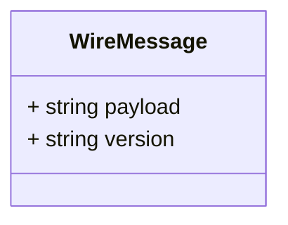
### Unsubscribe Diagram
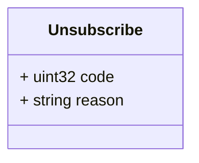
### ConnectRequest Diagram
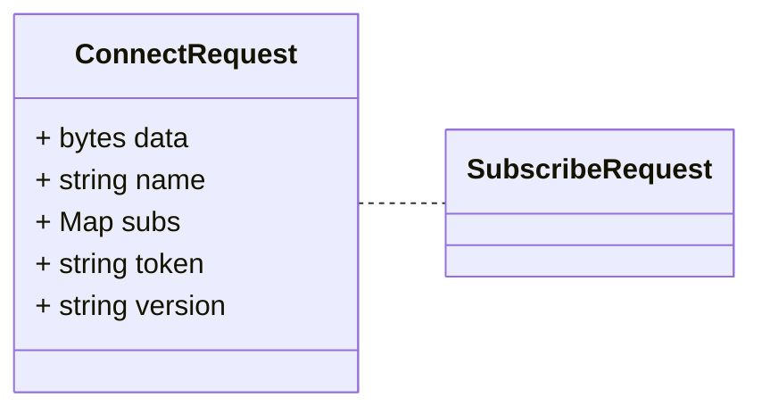
### ConnectResult Diagram
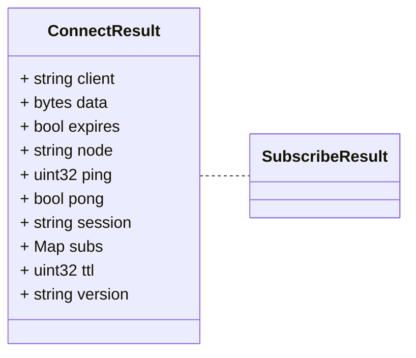
### SubscribeRequest Diagram
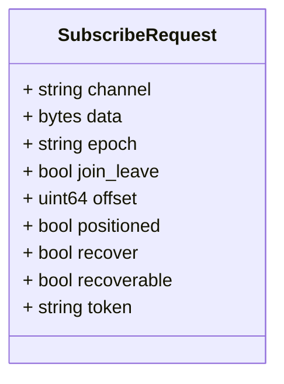
### SubscribeResult Diagram
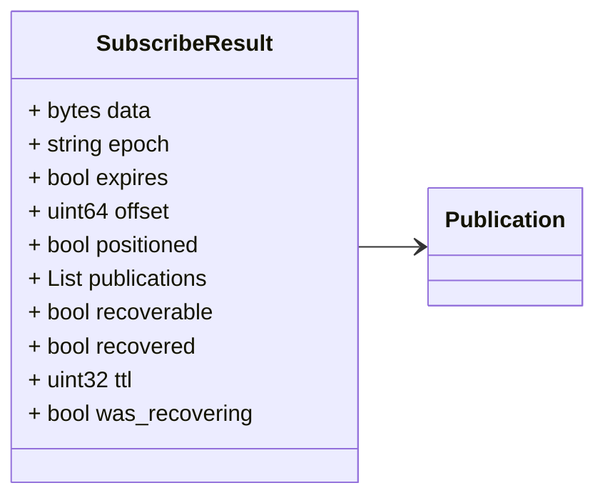
### UnsubscribeRequest Diagram
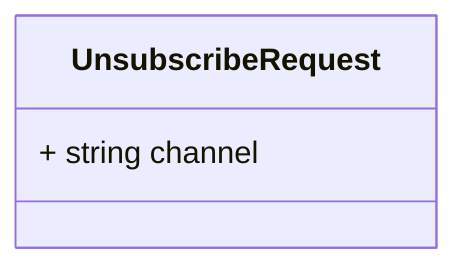
### UnsubscribeResult Diagram
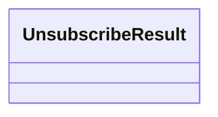
### PingRequest Diagram
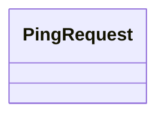
### PingResult Diagram
```mermaid
classDiagram
direction LR

%% 

class PingResult { }

```

## Message: Error
<div style="font-size: 12px; margin-top: -10px;" class="fqn">FQN: centrifugal.centrifuge.protocol.Error</div>

<div class="comment"><span></span><br/></div>

| Field     | Ordinal | Type   | Label | Description |
|-----------|---------|--------|-------|-------------|
| code      | 1       | uint32 |       |             |
| message   | 2       | string |       |             |
| temporary | 3       | bool   |       |             |


## Message: Command
<div style="font-size: 12px; margin-top: -10px;" class="fqn">FQN: centrifugal.centrifuge.protocol.Command</div>

<div class="comment"><span>Command sent from a client to a server. ProtocolVersion2 uses id and one of the possible request messages.</span><br/></div>

| Field          | Ordinal | Type                 | Label | Description                                                                                                                                                                                                                                                       |
|----------------|---------|----------------------|-------|-------------------------------------------------------------------------------------------------------------------------------------------------------------------------------------------------------------------------------------------------------------------|
| connect        | 4       | ConnectRequest       |       | ProtocolVersion2 client can send one of the following requests. Server will only take the first non-null request out of these and may return an error if client passed more than one request. We are not using oneof here due to JSON interoperability concerns.  |
| id             | 1       | uint32               |       | Id of command to let client match replies to commands.                                                                                                                                                                                                            |
| ping           | 11      | PingRequest          |       |                                                                                                                                                                                                                                                                   |
| subscribe      | 5       | SubscribeRequest     |       |                                                                                                                                                                                                                                                                   |
| unsubscribe    | 6       | UnsubscribeRequest   |       |                                                                                                                                                                                                                                                                   |


## Message: Reply
<div style="font-size: 12px; margin-top: -10px;" class="fqn">FQN: centrifugal.centrifuge.protocol.Reply</div>

<div class="comment"><span>Reply sent from a server to a client. ProtocolVersion2 uses id and one of the possible concrete result messages.</span><br/></div>

| Field          | Ordinal | Type                | Label | Description                                                                                                                       |
|----------------|---------|---------------------|-------|-----------------------------------------------------------------------------------------------------------------------------------|
| connect        | 5       | ConnectResult       |       |                                                                                                                                   |
| error          | 2       | Error               |       | Error can only be set in replies to commands. For pushes it will have zero value.                                                 |
| id             | 1       | uint32              |       | Id will only be set to a value > 0 for replies to commands. For pushes it will have zero value.                                   |
| ping           | 12      | PingResult          |       |                                                                                                                                   |
| push           | 4       | Push                |       | ProtocolVersion2 server can send one of the following fields. We are not using oneof here due to JSON interoperability concerns.  |
| subscribe      | 6       | SubscribeResult     |       |                                                                                                                                   |
| unsubscribe    | 7       | UnsubscribeResult   |       |                                                                                                                                   |


## Message: Push
<div style="font-size: 12px; margin-top: -10px;" class="fqn">FQN: centrifugal.centrifuge.protocol.Push</div>

<div class="comment"><span>Push can be sent to a client as part of Reply in case of bidirectional transport or without additional wrapping in case of unidirectional transports. ProtocolVersion2 uses channel and one of the possible concrete push messages.</span><br/></div>

| Field       | Ordinal | Type        | Label | Description                                                                                                                                     |
|-------------|---------|-------------|-------|-------------------------------------------------------------------------------------------------------------------------------------------------|
| channel     | 2       | string      |       |                                                                                                                                                 |
| pub         | 4       | Publication |       | ProtocolVersion2 server can push one of the following fields to the client. We are not using oneof here due to JSON interoperability concerns.  |
| unsubscribe | 7       | Unsubscribe |       |                                                                                                                                                 |


## Message: ClientInfo
<div style="font-size: 12px; margin-top: -10px;" class="fqn">FQN: centrifugal.centrifuge.protocol.ClientInfo</div>

<div class="comment"><span></span><br/></div>

| Field     | Ordinal | Type   | Label | Description |
|-----------|---------|--------|-------|-------------|
| chan_info | 4       | bytes  |       |             |
| client    | 2       | string |       |             |
| conn_info | 3       | bytes  |       |             |
| user      | 1       | string |       |             |


## Message: Publication
<div style="font-size: 12px; margin-top: -10px;" class="fqn">FQN: centrifugal.centrifuge.protocol.Publication</div>

<div class="comment"><span></span><br/></div>

| Field  | Ordinal | Type           | Label | Description               |
|--------|---------|----------------|-------|---------------------------|
| data   | 4       | WireMessage    |       | The Wire message envelope |
| info   | 5       | ClientInfo     |       |                           |
| offset | 6       | uint64         |       |                           |
| tags   | 7       | string, string | Map   |                           |


## Message: Unsubscribe
<div style="font-size: 12px; margin-top: -10px;" class="fqn">FQN: centrifugal.centrifuge.protocol.Unsubscribe</div>

<div class="comment"><span></span><br/></div>

| Field  | Ordinal | Type   | Label | Description |
|--------|---------|--------|-------|-------------|
| code   | 2       | uint32 |       |             |
| reason | 3       | string |       |             |


## Message: ConnectRequest
<div style="font-size: 12px; margin-top: -10px;" class="fqn">FQN: centrifugal.centrifuge.protocol.ConnectRequest</div>

<div class="comment"><span></span><br/></div>

| Field   | Ordinal | Type                     | Label | Description |
|---------|---------|--------------------------|-------|-------------|
| data    | 2       | bytes                    |       |             |
| name    | 4       | string                   |       |             |
| subs    | 3       | string, SubscribeRequest | Map   |             |
| token   | 1       | string                   |       |             |
| version | 5       | string                   |       |             |


## Message: ConnectResult
<div style="font-size: 12px; margin-top: -10px;" class="fqn">FQN: centrifugal.centrifuge.protocol.ConnectResult</div>

<div class="comment"><span></span><br/></div>

| Field   | Ordinal | Type                    | Label | Description |
|---------|---------|-------------------------|-------|-------------|
| client  | 1       | string                  |       |             |
| data    | 5       | bytes                   |       |             |
| expires | 3       | bool                    |       |             |
| node    | 10      | string                  |       |             |
| ping    | 7       | uint32                  |       |             |
| pong    | 8       | bool                    |       |             |
| session | 9       | string                  |       |             |
| subs    | 6       | string, SubscribeResult | Map   |             |
| ttl     | 4       | uint32                  |       |             |
| version | 2       | string                  |       |             |


## Message: SubscribeRequest
<div style="font-size: 12px; margin-top: -10px;" class="fqn">FQN: centrifugal.centrifuge.protocol.SubscribeRequest</div>

<div class="comment"><span></span><br/></div>

| Field       | Ordinal | Type   | Label | Description |
|-------------|---------|--------|-------|-------------|
| channel     | 1       | string |       |             |
| data        | 8       | bytes  |       |             |
| epoch       | 6       | string |       |             |
| join_leave  | 11      | bool   |       |             |
| offset      | 7       | uint64 |       |             |
| positioned  | 9       | bool   |       |             |
| recover     | 3       | bool   |       |             |
| recoverable | 10      | bool   |       |             |
| token       | 2       | string |       |             |


## Message: SubscribeResult
<div style="font-size: 12px; margin-top: -10px;" class="fqn">FQN: centrifugal.centrifuge.protocol.SubscribeResult</div>

<div class="comment"><span></span><br/></div>

| Field          | Ordinal | Type        | Label    | Description |
|----------------|---------|-------------|----------|-------------|
| data           | 11      | bytes       |          |             |
| epoch          | 6       | string      |          |             |
| expires        | 1       | bool        |          |             |
| offset         | 9       | uint64      |          |             |
| positioned     | 10      | bool        |          |             |
| publications   | 7       | Publication | Repeated |             |
| recoverable    | 3       | bool        |          |             |
| recovered      | 8       | bool        |          |             |
| ttl            | 2       | uint32      |          |             |
| was_recovering | 12      | bool        |          |             |


## Message: UnsubscribeRequest
<div style="font-size: 12px; margin-top: -10px;" class="fqn">FQN: centrifugal.centrifuge.protocol.UnsubscribeRequest</div>

<div class="comment"><span></span><br/></div>

| Field   | Ordinal | Type   | Label | Description |
|---------|---------|--------|-------|-------------|
| channel | 1       | string |       |             |


## Message: UnsubscribeResult
<div style="font-size: 12px; margin-top: -10px;" class="fqn">FQN: centrifugal.centrifuge.protocol.UnsubscribeResult</div>

<div class="comment"><span></span><br/></div>

| Field | Ordinal | Type | Label | Description |
|-------|---------|------|-------|-------------|


## Message: PingRequest
<div style="font-size: 12px; margin-top: -10px;" class="fqn">FQN: centrifugal.centrifuge.protocol.PingRequest</div>

<div class="comment"><span></span><br/></div>

| Field | Ordinal | Type | Label | Description |
|-------|---------|------|-------|-------------|


## Message: PingResult
<div style="font-size: 12px; margin-top: -10px;" class="fqn">FQN: centrifugal.centrifuge.protocol.PingResult</div>

<div class="comment"><span></span><br/></div>

| Field | Ordinal | Type | Label | Description |
|-------|---------|------|-------|-------------|
